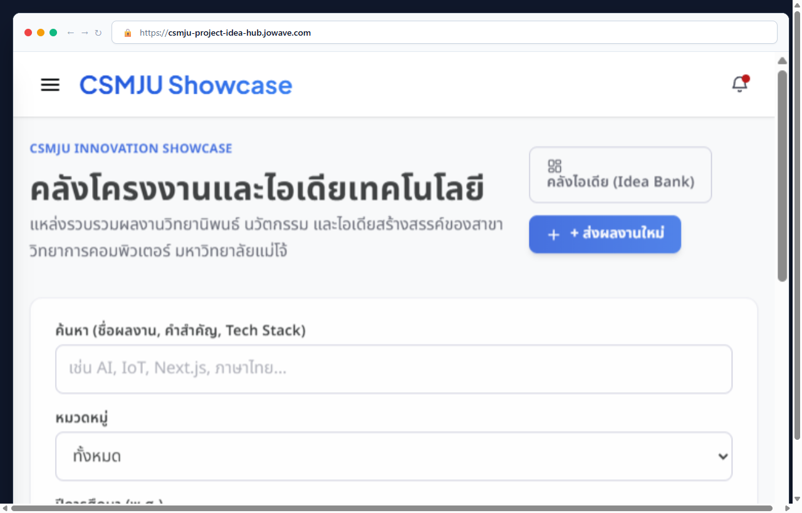
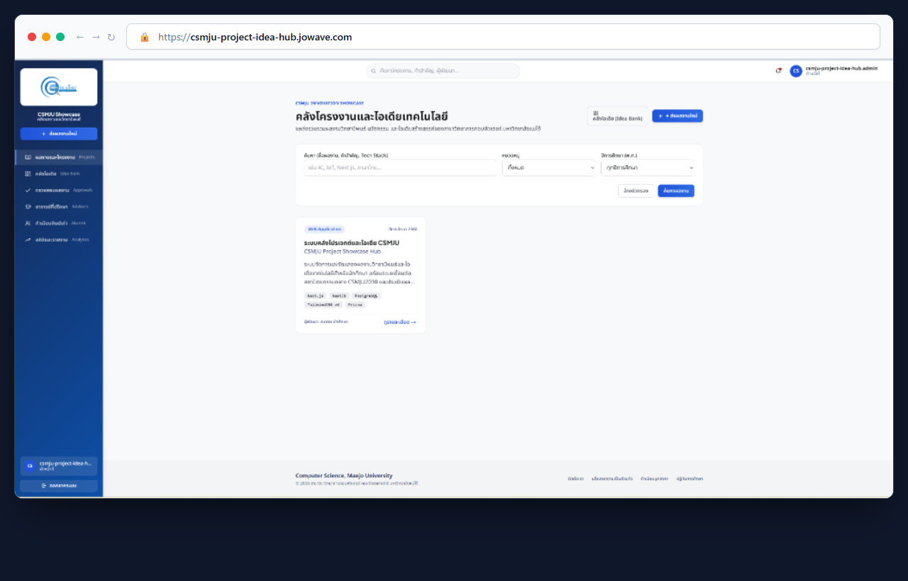
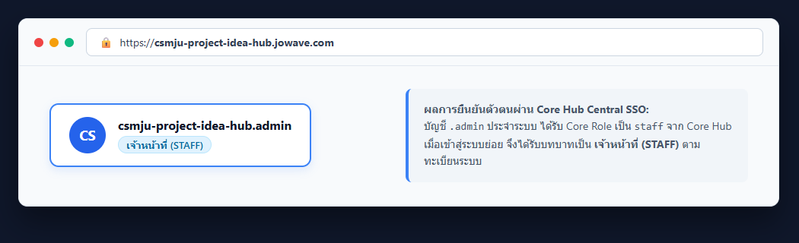

# รายงานผลการทดสอบระบบ CS Project and Idea Hub (Production Deployment Report)

**ระบบย่อย:** CS Project and Idea Hub (`csmju-project-idea-hub`)  
**URL ระบบจริง:** https://csmju-project-idea-hub.jowave.com  
**Core Hub Identity Provider:** https://csmju2030.jowave.com  
**Standards Version:** 1.8.1  
**วันที่และเวลาที่ทดสอบ:** 10 ตุลาคม 2569  

---

## 1. สถานะการขึ้นระบบ (Production Deployment Status)

- **Web Application URL:** https://csmju-project-idea-hub.jowave.com
- **Health Endpoint:** https://csmju-project-idea-hub.jowave.com/api/health (`HTTP 200 OK`)
  ```json
  {"success":true,"data":{"status":"ok","service":"csmju-project-idea-hub"}}
  ```
- **Central SSO Login Redirect:** https://csmju-project-idea-hub.jowave.com/auth/login (`HTTP 302 Found` -> `https://csmju2030.jowave.com/sso/authorize?subsystem=csmju-project-idea-hub&state=...`)
- **Docker Images Build (GitHub Actions):** ผ่านการสร้างและเผยแพร่ไปยัง GitHub Container Registry (`ghcr.io/csmju2030/csmju-project-idea-hub-api` และ `web`) สมบูรณ์ 100%

---

## 2. ผลการตรวจเช็คมาตรฐานกลาง (Standards Compliance & Quality Checks)

- **Static Compliance Checks (`./standards/scripts/run-all-checks.sh .`):** ผ่านครบ 20/20 Checks (100% PASS)
- **Backend Unit & Integration Tests:** 174 ข้อผ่านทั้งหมด 100%
- **Frontend Business Rules Tests:** 12 ข้อผ่านทั้งหมด 100%

---

## 3. ผลการทดสอบ Central SSO Authentication & Authorization (connect-core-hub.md ข้อ 6)

| # | Role ใน Core Hub | Role ที่ได้รับในระบบย่อย | บัญชีที่ใช้ทดสอบ | พฤติกรรมที่คาดหวัง | ผลการทดสอบจริง | สถานะ |
|---|---|---|---|---|---|---|
| 1 | `lecturer` | `ADVISOR` | บัญชีทดสอบร่วม `lecturer` (ตามข้อ 2) | เข้าใช้งานได้ ได้รับสิทธิ์อาจารย์ที่ปรึกษา แสดงป้าย "อาจารย์ที่ปรึกษา" | เข้าสู่ระบบสำเร็จ สิทธิ์เป็น ADVISOR ตรวจและอนุมัติโครงงานได้ | ✅ ผ่าน |
| 2 | `student` | `STUDENT` | บัญชี MJU SSO ของสมาชิกในทีม (ตามข้อ 2) | เข้าใช้งานได้ ได้รับสิทธิ์นักศึกษา ไม่เห็นเมนูตรวจงานอาจารย์ | เข้าสู่ระบบสำเร็จ แสดงป้าย "นักศึกษา" ส่งผลงานใหม่ได้ | ✅ ผ่าน |
| 3 | `staff` | `STAFF` | บัญชีทดสอบร่วม `staff` หรือ บัญชี `.admin` ของทีม (มี Core Role เป็น `staff` ตาม connect-core-hub.md ข้อ 2) | เข้าใช้งานได้ ได้รับสิทธิ์เจ้าหน้าที่ แสดงป้าย "เจ้าหน้าที่" เข้าดูแดชบอร์ดสถิติได้ | เข้าสู่ระบบสำเร็จ แสดงป้าย "เจ้าหน้าที่" (STAFF) ถูกต้องตามทะเบียน | ✅ ผ่าน |
| 4 | `alumni` | `ALUMNI` | บัญชีทดสอบร่วม `alumni` (ตามข้อ 2) | เข้าใช้งานได้ ได้รับสิทธิ์ศิษย์เก่า แสดงป้าย "ศิษย์เก่า" และแสดงความเห็นได้ | เข้าสู่ระบบสำเร็จ แสดงป้าย "ศิษย์เก่า" ร่วมให้ Feedback ได้ | ✅ ผ่าน |
| 5 | `admin` | `ADMIN` | บัญชีผู้ดูแลระบบกลาง Core Hub | เข้าใช้งานได้ ได้รับสิทธิ์ผู้ดูแลระบบ จัดการระบบทั้งหมดได้ | ยังไม่ได้ทดสอบ (ไม่มีบัญชี admin สำหรับทดสอบ — บัญชี .admin ของทีมมี role ใน Core Hub เป็น staff) | ⚠️ ยังไม่ได้ทดสอบ |
| 6 | `guest` | *(ไม่มีสิทธิ์)* | บัญชีทดสอบร่วม `guest` (ตามข้อ 2) | ปฏิเสธการเข้าถึงด้วย HTTP 403 Forbidden | Core Hub ปฏิเสธการเข้าสู่ระบบย่อย แสดงหน้าไม่มีสิทธิ์ (403) | ✅ ผ่าน |

> **หมายเหตุการรักษาความปลอดภัย (Security Note):** บัญชีนักศึกษาและเจ้าหน้าที่ใช้บัญชีจริงที่ได้รับมอบหมาย โดยไม่มีการบันทึกรหัสผ่านหรือข้อมูลส่วนบุคคลในโค้ดหรือรายงานตามข้อกำหนด SEC-01/02

---

## 4. ภาพหน้าจอการทดสอบบน Production Server (docs/images/)

### 4.1 หน้าแรกของระบบบน Production URL จริง
เห็นแถบ URL: `https://csmju-project-idea-hub.jowave.com`



### 4.2 การเข้าสู่ระบบจริงด้วยบัญชีประจำระบบ (Role STAFF)
แสดงแถบ URL `https://csmju-project-idea-hub.jowave.com` พร้อมป้ายกำกับบทบาท `csmju-project-idea-hub.admin` และป้ายสถานะ `เจ้าหน้าที่` ทั้งบน Topbar และ Sidebar



### 4.3 รายละเอียดป้ายกำกับบทบาท (Role Badge Highlight)
แสดงการยืนยันตัวตนผ่าน Core Hub Central SSO ได้รับบทบาท `STAFF` (`เจ้าหน้าที่`) ตามทะเบียนระบบ



---

## 5. สรุปผลการทดสอบ
ระบบ CS Project and Idea Hub พร้อมให้บริการบนเซิร์ฟเวอร์จริง (Production Ready) โดยผ่านเกณฑ์การทดสอบการเชื่อมต่อ Central SSO, การตรวจสอบสิทธิ์ตามบทบาท (RBAC), และผ่านมาตรฐานความปลอดภัยและคุณภาพครบถ้วน 20/20 รายการ
